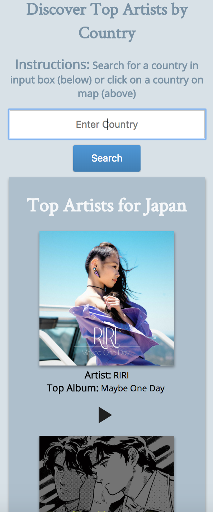
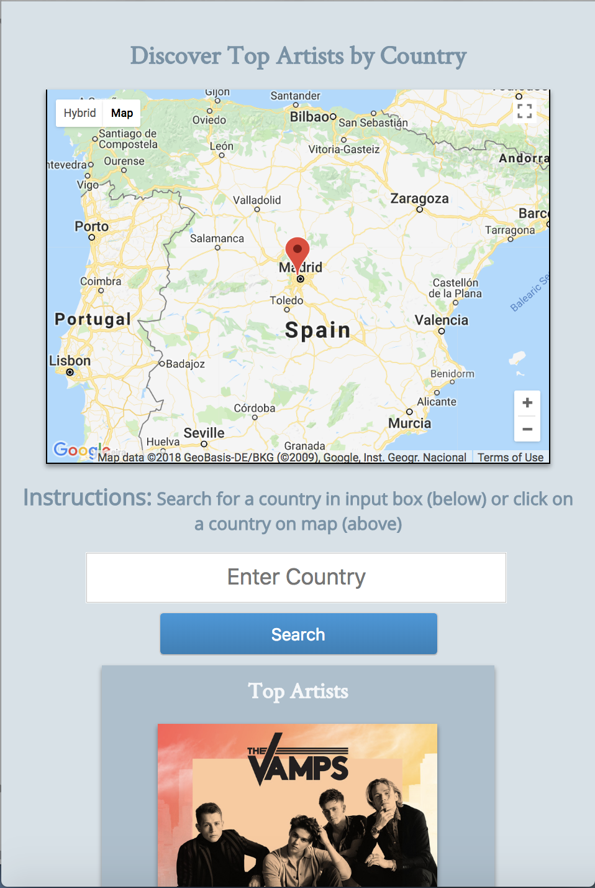
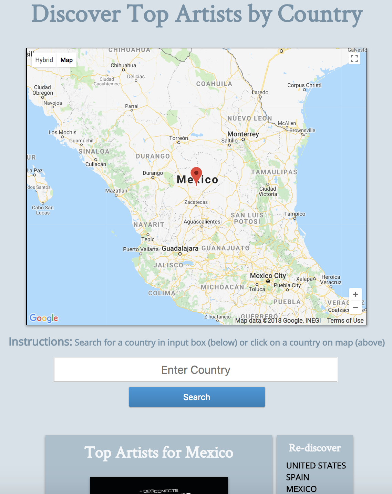

<h1>Spotify Top Artists by Country</h1>

The application was developed with the objective of identifying top artists, via Spotify API, by country.

<h5>Application:</h5> https://spotify-cap.herokuapp.com/
<h5>Instructions:</h5>
<ul>
	<li>Option 1: Enter country into input box</li>
	<li>Option 2: Drag location marker on map to desired country</li>
</ul>

<h3>API</h3>
<ul>
  <li>Google Maps (https://developers.google.com/maps/documentation/javascript/tutorial)</li>
  <li>Spotify (https://github.com/thelinmichael/spotify-web-api-node)</li>
</ul>

<h3>Technology</h3>
<ul>
  <li>HTML (Handlebars)</li>
  <li>CSS</li>
  <li>JavaScript</li>
  <li>jQuery</li>
  <li>Sass</li>
  <li>Gulp</li>
</ul>

<h3>Screenshots</h3>
<h5>Small Viewport</h5>

<h5>Medium Viewport</h5>

<h5>Large Viewport</h5>

